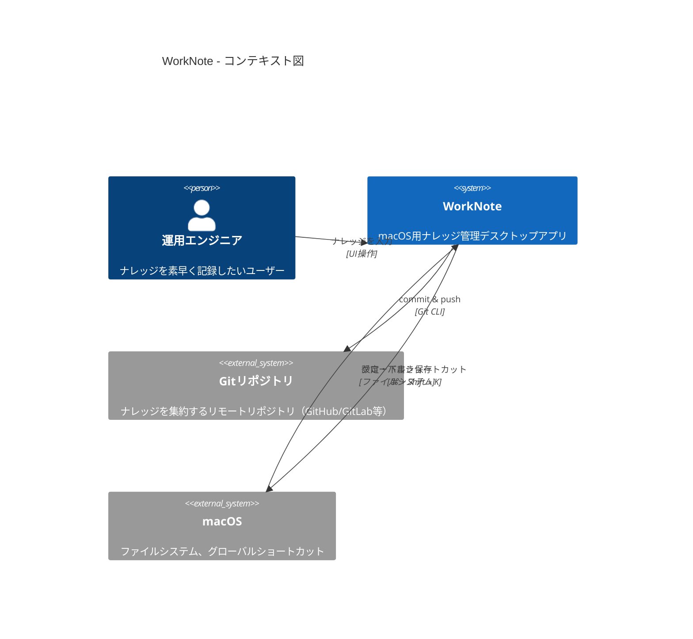
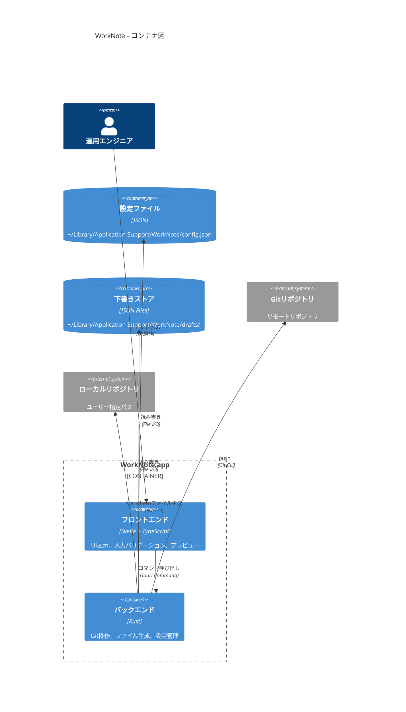
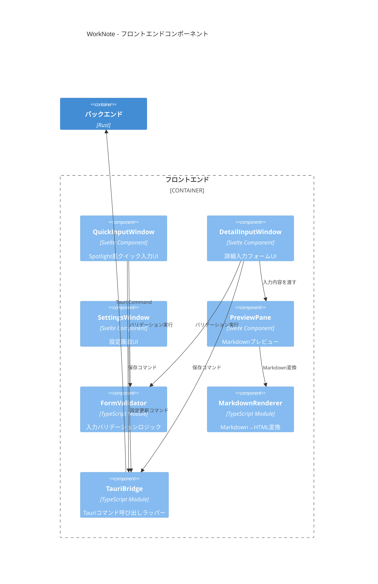
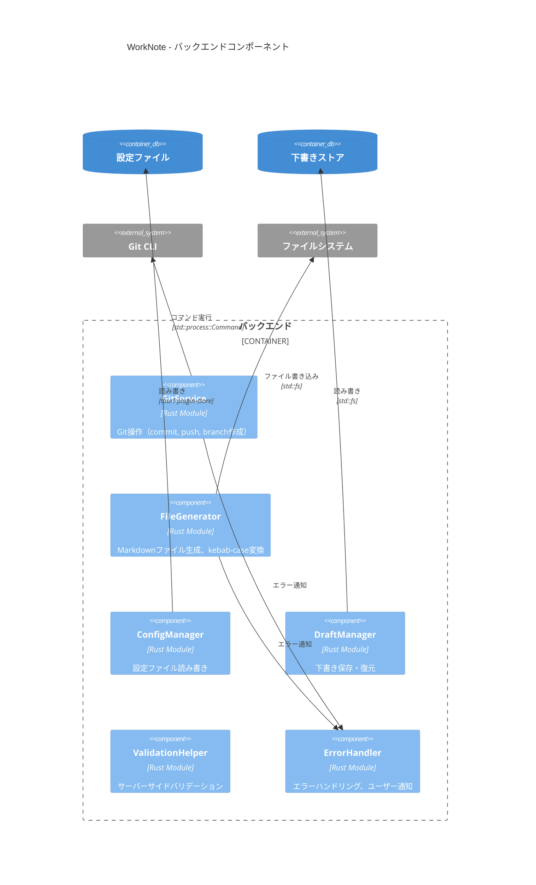

# アーキテクチャ設計書: WorkNote

## 概要

本ドキュメントは、WorkNoteアプリケーションのアーキテクチャをC4モデル（Context, Container, Component, Code）で記述します。

---

## C4モデル

### Level 1: コンテキスト図（Context Diagram）

システムの境界と外部システムとの関係を示します。



**説明**:
- **運用エンジニア**: WorkNoteを使ってナレッジを記録
- **WorkNote**: ナレッジ入力を受け付け、Markdownファイルを生成
- **Gitリポジトリ**: 生成されたMarkdownをチームで共有
- **macOS**: 設定・下書きの永続化、グローバルショートカット管理

---

### Level 2: コンテナ図（Container Diagram）

アプリケーション内のコンテナ（実行可能単位）を示します。



**説明**:
- **フロントエンド（Svelte）**: ユーザーインターフェース、入力バリデーション、リアルタイムプレビュー
- **バックエンド（Rust）**: Git操作、ファイル生成、設定・下書き管理
- **設定ファイル**: リポジトリパス、Author情報などの永続化
- **下書きストア**: 入力途中の内容を保存
- **ローカルリポジトリ**: Markdownファイルの保存先
- **リモートリポジトリ**: チーム共有用のGitリポジトリ

---

### Level 3: コンポーネント図（Component Diagram）

#### 3.1 フロントエンド（Svelte）コンポーネント



**主要コンポーネント**:

| コンポーネント | 責務 |
|----------------|------|
| **QuickInputWindow** | Spotlight風クイック入力UI（480x280px固定） |
| **DetailInputWindow** | 詳細入力フォームUI（リサイズ可能） |
| **SettingsWindow** | リポジトリ設定、Author設定、ショートカット設定 |
| **PreviewPane** | Markdownプレビュー表示 |
| **FormValidator** | 入力バリデーション（文字数制限、必須チェック） |
| **MarkdownRenderer** | Markdown→HTML変換（プレビュー用） |
| **TauriBridge** | Rustバックエンドへのコマンド呼び出しラッパー |

---

#### 3.2 バックエンド（Rust）コンポーネント



**主要コンポーネント**:

| コンポーネント | 責務 |
|----------------|------|
| **GitService** | Git操作（status, pull, add, commit, push, branch作成） |
| **FileGenerator** | Markdownファイル生成、ファイル名変換（kebab-case） |
| **ConfigManager** | 設定ファイルの読み書き、デフォルト値提供 |
| **DraftManager** | 下書きの保存・復元、UUID生成 |
| **ValidationHelper** | サーバーサイドバリデーション（二重チェック） |
| **ErrorHandler** | エラーハンドリング、ユーザーフレンドリーなメッセージ生成 |

---

### Level 4: コード図（Code Diagram）

#### 4.1 主要インターフェース（TypeScript）

```typescript
// フロントエンド型定義

/**
 * ナレッジ入力データ
 */
interface KnowledgeInput {
  title: string;              // タイトル（1-100文字）
  category: Category;         // カテゴリ
  severity: Severity;         // 重要度
  symptoms?: string;          // 症状・検知条件（最大5000文字）
  procedure?: string;         // 対応手順（最大10000文字）
  notes?: string;             // 注意点（最大3000文字）
  links?: string;             // 関連リンク（最大1000文字）
}

/**
 * カテゴリ種別
 */
type Category = 'alerts' | 'maintenance' | 'troubleshooting';

/**
 * 重要度
 */
type Severity = 'low' | 'medium' | 'high' | 'critical';

/**
 * 設定データ
 */
interface Config {
  version: number;
  git: GitConfig;
  author: AuthorConfig;
  shortcuts: ShortcutConfig;
  preferences: PreferencesConfig;
}

interface GitConfig {
  repositoryPath: string;     // リポジトリパス
  savePath: string;           // ナレッジ保存先（相対パス）
  defaultBranch: string;      // デフォルトブランチ
  commitMode: CommitMode;     // コミットモード
}

type CommitMode = 'direct' | 'pr';

interface AuthorConfig {
  name: string;
  email: string;
}

interface ShortcutConfig {
  quickInput: string;         // グローバルショートカット
}

interface PreferencesConfig {
  launchAtLogin: boolean;
  showInMenuBar: boolean;
  showNotifications: boolean;
}

/**
 * 下書きデータ
 */
interface Draft {
  id: string;                 // UUID
  createdAt: string;          // ISO 8601形式
  updatedAt: string;          // ISO 8601形式
  data: KnowledgeInput;
}

/**
 * バリデーション結果
 */
interface ValidationResult {
  valid: boolean;
  errors: ValidationError[];
}

interface ValidationError {
  field: string;
  message: string;
}
```

---

#### 4.2 主要構造体（Rust）

```rust
// バックエンド型定義

use serde::{Deserialize, Serialize};
use std::path::PathBuf;

/// ナレッジ入力データ
#[derive(Debug, Clone, Serialize, Deserialize)]
pub struct KnowledgeInput {
    pub title: String,
    pub category: Category,
    pub severity: Severity,
    pub symptoms: Option<String>,
    pub procedure: Option<String>,
    pub notes: Option<String>,
    pub links: Option<String>,
}

/// カテゴリ種別
#[derive(Debug, Clone, Serialize, Deserialize)]
#[serde(rename_all = "lowercase")]
pub enum Category {
    Alerts,
    Maintenance,
    Troubleshooting,
}

/// 重要度
#[derive(Debug, Clone, Serialize, Deserialize)]
#[serde(rename_all = "lowercase")]
pub enum Severity {
    Low,
    Medium,
    High,
    Critical,
}

/// 設定データ
#[derive(Debug, Clone, Serialize, Deserialize)]
pub struct Config {
    pub version: u32,
    pub git: GitConfig,
    pub author: AuthorConfig,
    pub shortcuts: ShortcutConfig,
    pub preferences: PreferencesConfig,
}

#[derive(Debug, Clone, Serialize, Deserialize)]
pub struct GitConfig {
    pub repository_path: PathBuf,
    pub save_path: String,
    pub default_branch: String,
    pub commit_mode: CommitMode,
}

#[derive(Debug, Clone, Serialize, Deserialize)]
#[serde(rename_all = "lowercase")]
pub enum CommitMode {
    Direct,
    Pr,
}

#[derive(Debug, Clone, Serialize, Deserialize)]
pub struct AuthorConfig {
    pub name: String,
    pub email: String,
}

#[derive(Debug, Clone, Serialize, Deserialize)]
pub struct ShortcutConfig {
    pub quick_input: String,
}

#[derive(Debug, Clone, Serialize, Deserialize)]
pub struct PreferencesConfig {
    pub launch_at_login: bool,
    pub show_in_menu_bar: bool,
    pub show_notifications: bool,
}

/// Git操作結果
#[derive(Debug)]
pub struct GitResult {
    pub success: bool,
    pub branch: String,
    pub commit_hash: Option<String>,
    pub pr_url: Option<String>,
}

/// エラー型
#[derive(Debug, thiserror::Error)]
pub enum WorkNoteError {
    #[error("Git操作エラー: {0}")]
    GitError(String),

    #[error("ファイル操作エラー: {0}")]
    FileError(String),

    #[error("バリデーションエラー: {0}")]
    ValidationError(String),

    #[error("設定エラー: {0}")]
    ConfigError(String),
}
```

---

## アーキテクチャ決定記録（ADR）

### ADR-001: Tauriフレームワークの採用

**決定**: Tauri v2を採用する

**理由**:
- 軽量（5-10MB）でElectron（150MB+）と比較して大幅に小さい
- 高速起動（Rustバックエンド）
- Web技術（Svelte + TypeScript）で開発可能
- macOSネイティブ機能へのアクセス（グローバルショートカット等）
- チームの学習コストが低い

**代替案**:
- Electron: 重い、メモリ使用量が多い
- Swift（ネイティブ）: 学習コストが高い、チーム親和性が低い

---

### ADR-002: Git CLIの直接実行

**決定**: libgit2等のライブラリを使わず、Git CLIコマンドを直接実行する

**理由**:
- シンプル（依存関係を減らす）
- ユーザーのGit設定（SSH鍵、Credential Helper）をそのまま利用可能
- デバッグしやすい（コマンドがそのまま見える）

**トレードオフ**:
- Git未インストール環境では動作しない → 初回起動時に案内
- パフォーマンスはlibgit2より劣る可能性 → 小規模な操作なので影響軽微

---

### ADR-003: ファイルベースの設定・下書き管理

**決定**: 設定・下書きをローカルファイルシステムに保存する

**理由**:
- シンプル（データベース不要）
- デバッグしやすい（JSONファイルを直接確認可能）
- バックアップしやすい

**保存先**:
- 設定: `~/Library/Application Support/WorkNote/config.json`
- 下書き: `~/Library/Application Support/WorkNote/drafts/{uuid}.json`

---

### ADR-004: フロントエンドにSvelteを採用

**決定**: Svelteをフロントエンドフレームワークとして採用する

**理由**:
- シンプルな構文（Reactより学習コストが低い）
- 高速レンダリング（コンパイラベース）
- リアクティブな状態管理が標準で組み込まれている
- バンドルサイズが小さい

**代替案**:
- React: より複雑、バンドルサイズが大きい
- Vue: Svelteと同等だが、Svelteの方がシンプル

---

## 非機能アーキテクチャ

### パフォーマンス最適化

| 項目 | 戦略 |
|------|------|
| アプリ起動 | 遅延ロード、初期化の最小化 |
| ウィンドウ表示 | Svelte Transition、最小限のDOM操作 |
| メモリ使用量 | 大きなデータの避ける、必要に応じて解放 |
| バンドルサイズ | Tree shaking、コード分割 |

### セキュリティ

| 項目 | 対策 |
|------|------|
| Git認証 | アプリ内に保存しない、OS/ツールに委譲 |
| 設定ファイル | ユーザー権限でのみアクセス可能 |
| ネットワーク | Git操作のみ、直接通信なし |
| 入力検証 | フロントエンド+バックエンドで二重チェック |

### エラーハンドリング

| エラー種別 | 対応 |
|------------|------|
| Git認証エラー | 設定手順案内、下書き保存 |
| ネットワークエラー | リトライ選択肢、下書き保存 |
| ファイル名衝突 | タイムスタンプ付加 or 上書き確認 |
| バリデーションエラー | 具体的なメッセージ表示 |

---

## 配置図（Deployment Diagram）

```
┌─────────────────────────────────────────────────────────────┐
│  macOS (Monterey 12+)                                       │
│                                                             │
│  ┌─────────────────────────────────────────────────────┐   │
│  │  WorkNote.app                                       │   │
│  │  ┌────────────────┐  ┌────────────────────────┐    │   │
│  │  │ Svelte         │  │ Rust                   │    │   │
│  │  │ (WebView)      │◄─┤ Tauri Core             │    │   │
│  │  └────────────────┘  └────────────────────────┘    │   │
│  └─────────────────────────────────────────────────────┘   │
│                               │                             │
│                               ▼                             │
│  ┌─────────────────────────────────────────────────────┐   │
│  │  ~/Library/Application Support/WorkNote/            │   │
│  │  ├─ config.json                                     │   │
│  │  └─ drafts/                                         │   │
│  │     ├─ {uuid-1}.json                                │   │
│  │     └─ {uuid-2}.json                                │   │
│  └─────────────────────────────────────────────────────┘   │
│                               │                             │
│                               ▼                             │
│  ┌─────────────────────────────────────────────────────┐   │
│  │  ユーザー指定パス（ローカルリポジトリ）                │
│  │  ~/projects/your-repo/                              │   │
│  │  └─ docs/runbooks/                                  │   │
│  │     ├─ alerts/                                      │   │
│  │     ├─ maintenance/                                 │   │
│  │     └─ troubleshooting/                             │   │
│  └─────────────────────────────────────────────────────┘   │
│                               │                             │
└───────────────────────────────┼─────────────────────────────┘
                                │
                                ▼
                    ┌───────────────────────┐
                    │  リモートリポジトリ   │
                    │  (GitHub/GitLab等)   │
                    └───────────────────────┘
```

---

## まとめ

WorkNoteのアーキテクチャは以下の特徴を持ちます：

1. **シンプルさ**: ファイルベース、Git CLI直接実行
2. **軽量性**: Tauri v2、コンパクトなバンドル
3. **保守性**: TypeScript + Rust、型安全
4. **拡張性**: コンポーネントベース、明確な責務分離

---

**文書情報**

| 項目 | 内容 |
|------|------|
| 作成日 | 2026-01-31 |
| 作成者 | Claude Code (michi:create-design) |
| バージョン | 1.0 |
| ステータス | 承認待ち |
