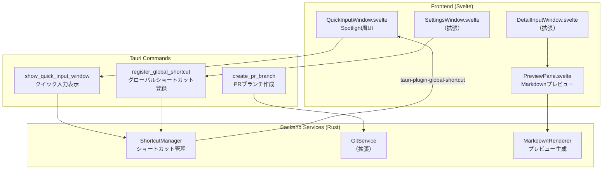
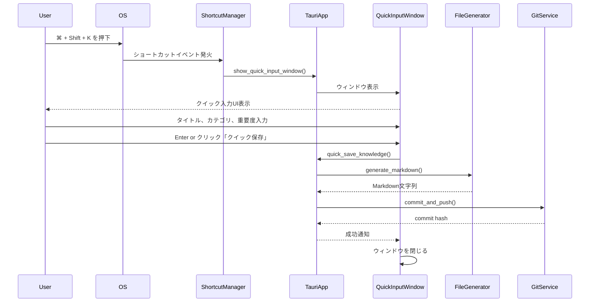
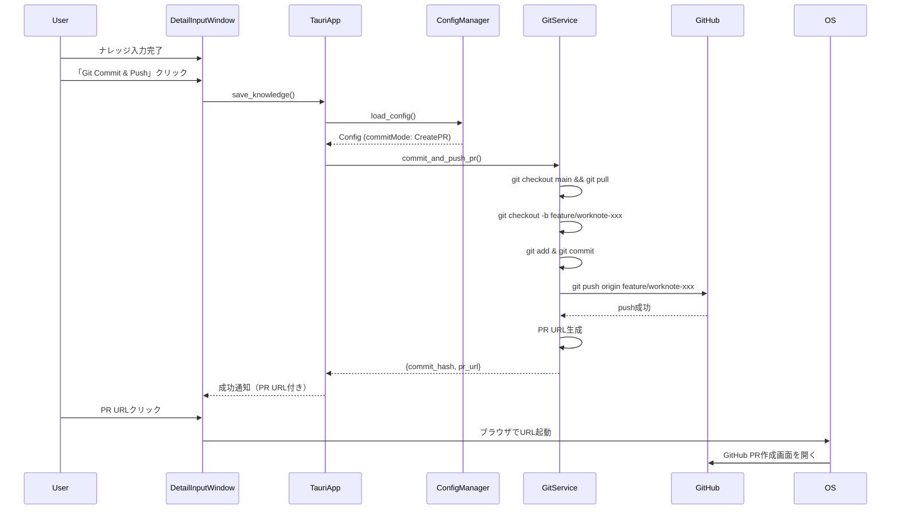
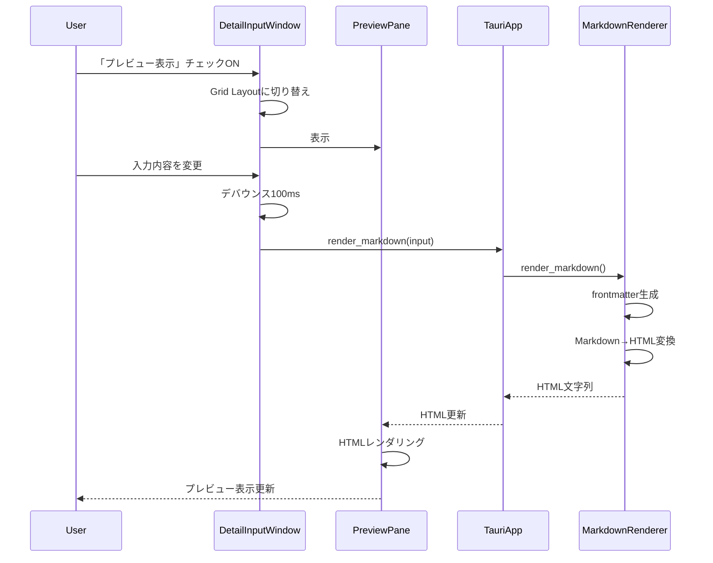

# Phase 2 設計書: WorkNote

## 概要

Phase 2では、Spotlight風クイック入力、PR作成モード、Markdownプレビュー、グローバルショートカットを追加します。

## アーキテクチャ設計

### 追加コンポーネント



### ウィンドウ管理

Phase 2では2つのウィンドウを管理します：

1. **QuickInput Window**（新規）
   - Label: `quick-input`
   - サイズ: 480×280px（固定）
   - 位置: 画面中央上部
   - 常に最前面表示
   - グローバルショートカットで表示/非表示切り替え

2. **Detail Input Window**（既存、拡張）
   - Label: `main`
   - サイズ: 720×800px（リサイズ可能）
   - プレビューペイン追加時は幅を2倍に拡張

### タスク分割

#### TASK-201: tauri-plugin-global-shortcut導入

**依存関係:** なし

**実装内容:**
1. `src-tauri/Cargo.toml`に依存追加
   ```toml
   [dependencies]
   tauri-plugin-global-shortcut = "2.0.0"
   ```
2. `src-tauri/src/lib.rs`でプラグイン登録
3. 初期設定で`CommandOrControl+Shift+K`を登録

**テスト:**
- グローバルショートカットが他アプリフォーカス時でも動作するか
- 既存のシステムショートカットと競合しないか

#### TASK-202: ShortcutManager実装

**依存関係:** TASK-201

**実装内容:**
1. `src-tauri/src/services/shortcut_manager.rs`作成
   - `register_shortcut(app: AppHandle, shortcut: String) -> Result<()>`
   - `unregister_shortcut(app: AppHandle) -> Result<()>`
   - イベントハンドラでQuickInput Windowの表示/非表示切り替え

**テスト:**
- ショートカット登録/解除が正しく動作するか
- 複数回の登録で競合しないか

#### TASK-203: QuickInput Window UI実装

**依存関係:** なし

**実装内容:**
1. `src/components/QuickInputWindow.svelte`作成
   - タイトル入力（必須）
   - カテゴリ選択（必須）
   - 重要度選択（必須）
   - 「詳細入力へ」ボタン
   - 「クイック保存」ボタン
2. スタイリング（Tailwind CSS）
   - 固定サイズ: 480×280px
   - 角丸、影付き

**テスト:**
- UIが仕様通りのサイズで表示されるか
- フォーカスがタイトル入力欄に当たるか
- Escキーで閉じるか

#### TASK-204: QuickInput Window統合

**依存関係:** TASK-202, TASK-203

**実装内容:**
1. `src-tauri/tauri.conf.json`にquick-inputウィンドウ定義追加
   ```json
   {
     "label": "quick-input",
     "title": "WorkNote - クイック入力",
     "width": 480,
     "height": 280,
     "resizable": false,
     "center": true,
     "alwaysOnTop": true
   }
   ```
2. `src-tauri/src/commands/window.rs`作成
   - `show_quick_input_window(app: AppHandle) -> Result<()>`
   - `hide_quick_input_window(app: AppHandle) -> Result<()>`
3. ShortcutManagerからwindow commandsを呼び出す

**テスト:**
- グローバルショートカットでウィンドウが表示されるか
- Escキーでウィンドウが非表示になるか
- 常に最前面に表示されるか

#### TASK-205: クイック保存機能実装

**依存関係:** TASK-204

**実装内容:**
1. `src/lib/tauri-bridge.ts`に`quickSaveKnowledge`関数追加
2. `src-tauri/src/commands/knowledge.rs`に`quick_save_knowledge`コマンド追加
   - タイトル、カテゴリ、重要度のみを受け取る
   - 他のフィールドは空文字列で生成
   - FileGenerator, GitServiceを呼び出す
3. QuickInputWindow.svelteから呼び出し

**テスト:**
- クイック保存でMarkdownファイルが生成されるか
- frontmatterに必須フィールドのみ含まれるか
- Git commit & pushが実行されるか

#### TASK-206: GitServiceにPR作成モード追加

**依存関係:** なし

**実装内容:**
1. `src-tauri/src/services/git_service.rs`を拡張
   - `commit_and_push_pr()`メソッド追加
   - featureブランチ作成: `feature/worknote-{title}-{timestamp}`
   - featureブランチをpush
   - GitHub PR作成URL生成: `https://github.com/{owner}/{repo}/compare/{branch}`
2. リポジトリownerとrepo名の取得ロジック追加
   - `git remote get-url origin`を実行
   - URLからowner/repoを抽出

**テスト:**
- featureブランチが正しく作成されるか
- featureブランチにpushされるか
- PR URL生成が正しいか
- デフォルトブランチに影響しないか

#### TASK-207: Config型にcommitMode追加

**依存関係:** なし

**実装内容:**
1. `src-tauri/src/models/config.rs`を拡張
   ```rust
   #[derive(Serialize, Deserialize)]
   pub enum CommitMode {
       DirectPush,
       CreatePR,
   }

   pub struct GitConfig {
       pub repository_path: String,
       pub save_path: String,
       pub default_branch: String,
       pub commit_mode: CommitMode, // 追加
   }
   ```
2. `src/lib/types.ts`にCommitMode型追加
3. デフォルト値: `DirectPush`

**テスト:**
- 既存のconfig.jsonが読み込めるか（後方互換性）
- commitModeがない場合はDirectPushになるか

#### TASK-208: SettingsWindowにcommitMode選択追加

**依存関係:** TASK-207

**実装内容:**
1. `src/components/SettingsWindow.svelte`を拡張
   - ラジオボタン追加: 「直接Push」「PR作成」
   - デフォルト: 「直接Push」
2. 保存時にcommitModeをconfig.jsonに書き込み

**テスト:**
- commitMode変更が保存されるか
- アプリ再起動後も設定が保持されるか

#### TASK-209: save_knowledge CommandでcommitMode対応

**依存関係:** TASK-206, TASK-207

**実装内容:**
1. `src-tauri/src/commands/knowledge.rs`を修正
   - ConfigからcommitModeを取得
   - DirectPushの場合: `git_service.commit_and_push()`
   - CreatePRの場合: `git_service.commit_and_push_pr()`
2. レスポンス型を拡張
   ```rust
   #[derive(Serialize)]
   pub struct SaveKnowledgeResponse {
       pub commit_hash: String,
       pub pr_url: Option<String>, // 追加
   }
   ```

**テスト:**
- DirectPushモードで直接pushされるか
- CreatePRモードでfeatureブランチが作成されるか
- レスポンスにpr_urlが含まれるか

#### TASK-210: Markdownレンダラー実装

**依存関係:** なし

**実装内容:**
1. `src-tauri/Cargo.toml`に依存追加
   ```toml
   pulldown-cmark = "0.9"
   ```
2. `src-tauri/src/services/markdown_renderer.rs`作成
   - `render_markdown(input: &KnowledgeInput) -> Result<String>`
   - FileGeneratorの`generate_markdown()`を再利用
   - frontmatter + body をHTML変換

**テスト:**
- Markdown見出し、リスト、コードブロックが正しくレンダリングされるか
- frontmatterがYAMLとして表示されるか

#### TASK-211: PreviewPane UI実装

**依存関係:** なし

**実装内容:**
1. `src/components/PreviewPane.svelte`作成
   - プロップ: `content: string`（レンダリング済みHTML）
   - スタイリング: Tailwind CSS Proseプラグイン
   - スクロール可能な領域

**テスト:**
- HTMLコンテンツが正しく表示されるか
- スクロールが動作するか

#### TASK-212: DetailInputWindowにプレビュー統合

**依存関係:** TASK-210, TASK-211

**実装内容:**
1. `src/components/DetailInputWindow.svelte`を拡張
   - 「プレビュー表示」チェックボックス追加
   - チェックON時: ウィンドウを2分割（Grid Layout）
   - 入力内容変更時: デバウンス100msでプレビュー更新
   - `render_markdown` Tauri Commandを呼び出し
2. `src-tauri/src/commands/markdown.rs`作成
   - `render_markdown(input: KnowledgeInput) -> Result<String>`

**テスト:**
- チェックボックスON/OFFでレイアウトが切り替わるか
- 入力変更がリアルタイムで反映されるか（デバウンス確認）
- プレビューが正確か

#### TASK-213: E2Eテスト追加（オプション）

**依存関係:** すべてのタスク完了後

**実装内容:**
1. tauri-driverセットアップ
2. グローバルショートカットのテスト
3. クイック保存のE2Eテスト
4. PR作成モードのE2Eテスト
5. プレビュー表示のE2Eテスト

## シーケンス図

### グローバルショートカット起動フロー



### PR作成モードフロー



### Markdownプレビューフロー



## データモデル拡張

### Config拡張

```rust
#[derive(Debug, Clone, Serialize, Deserialize)]
#[serde(rename_all = "lowercase")]
pub enum CommitMode {
    #[serde(rename = "direct")]
    DirectPush,
    #[serde(rename = "pr")]
    CreatePR,
}

#[derive(Debug, Clone, Serialize, Deserialize)]
pub struct GitConfig {
    pub repository_path: String,
    pub save_path: String,
    pub default_branch: String,
    #[serde(default = "default_commit_mode")]
    pub commit_mode: CommitMode,
}

fn default_commit_mode() -> CommitMode {
    CommitMode::DirectPush
}

#[derive(Debug, Clone, Serialize, Deserialize)]
pub struct ShortcutConfig {
    #[serde(default = "default_quick_input_shortcut")]
    pub quick_input: String,
}

fn default_quick_input_shortcut() -> String {
    "CommandOrControl+Shift+K".to_string()
}

#[derive(Debug, Clone, Serialize, Deserialize)]
pub struct Config {
    pub version: u32,
    pub git: GitConfig,
    pub author: AuthorConfig,
    #[serde(default)]
    pub shortcuts: ShortcutConfig,
}
```

### SaveKnowledgeResponse拡張

```rust
#[derive(Debug, Serialize)]
pub struct SaveKnowledgeResponse {
    pub commit_hash: String,
    pub file_path: String,
    pub pr_url: Option<String>,
}
```

## エラーハンドリング

### 新しいエラー型

```rust
#[derive(Debug, Error)]
pub enum WorkNoteError {
    // ... 既存のエラー型 ...

    #[error("Shortcut registration failed: {0}")]
    ShortcutError(String),

    #[error("Window not found: {0}")]
    WindowNotFoundError(String),

    #[error("Markdown rendering failed: {0}")]
    MarkdownRenderError(String),

    #[error("Remote URL parsing failed: {0}")]
    RemoteUrlParseError(String),
}
```

## セキュリティ考慮事項

### グローバルショートカット

- システムショートカットと競合しないか確認
- ユーザーがカスタマイズ可能にする
- 無効なショートカット文字列はエラー表示

### PR URL生成

- リモートURL取得時の検証
- HTTPSのみ許可
- GitHub以外のURLは警告表示

### Markdownレンダリング

- XSS対策: HTMLエスケープ
- 外部リソース読み込み禁止
- サンドボックス内でレンダリング

## パフォーマンス最適化

### プレビュー更新

- デバウンス100ms: 連続入力時の負荷軽減
- 仮想DOM差分更新: Svelteの最適化を活用
- 長文の場合は1000文字ごとに分割レンダリング

### ウィンドウ表示

- QuickInput Windowは常駐（非表示状態で保持）
- 初回表示時のみ初期化、以降はshow/hide切り替え

## 後方互換性

- Phase 1のconfig.jsonにcommitModeフィールドがない場合、DirectPushをデフォルト値とする
- Phase 1で作成したMarkdownファイルはそのまま読み込み可能
- Phase 1のUIも引き続き利用可能

## テスト戦略

### 単体テスト

- ShortcutManager: ショートカット登録/解除
- GitService (拡張): PR作成フロー
- MarkdownRenderer: HTML変換の正確性

### 統合テスト

- QuickInput Window → Tauri Command → GitService
- DetailInput Window → PreviewPane → MarkdownRenderer

### E2Eテスト

- グローバルショートカット起動
- クイック保存
- PR作成モード
- プレビュー表示

## 実装優先順位

1. **高優先度**（コア機能）
   - TASK-201, 202, 203, 204, 205: クイック入力
   - TASK-206, 207, 208, 209: PR作成モード

2. **中優先度**（ユーザビリティ）
   - TASK-210, 211, 212: Markdownプレビュー

3. **低優先度**（オプション）
   - TASK-213: E2Eテスト

## 参照

- Phase 1設計書: `docs/michi/20260131-worknote/spec/design.md`
- Phase 2要件定義: `docs/michi/20260131-worknote/spec/phase2-requirements.md`
- tauri-plugin-global-shortcut: https://github.com/tauri-apps/tauri-plugin-global-shortcut
- pulldown-cmark: https://github.com/raphlinus/pulldown-cmark
