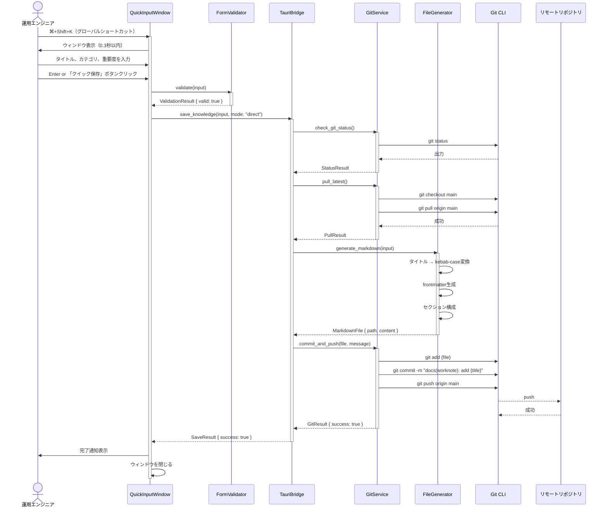
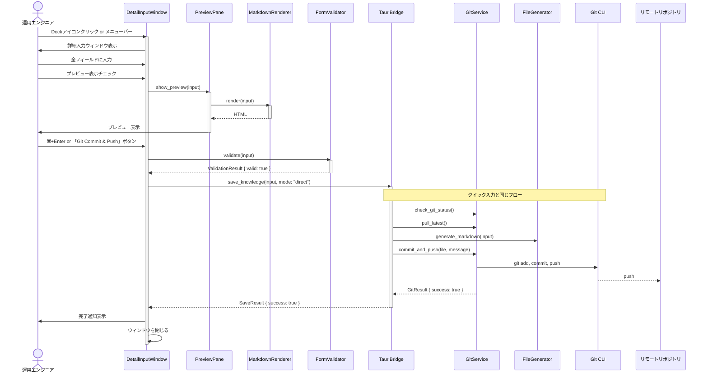
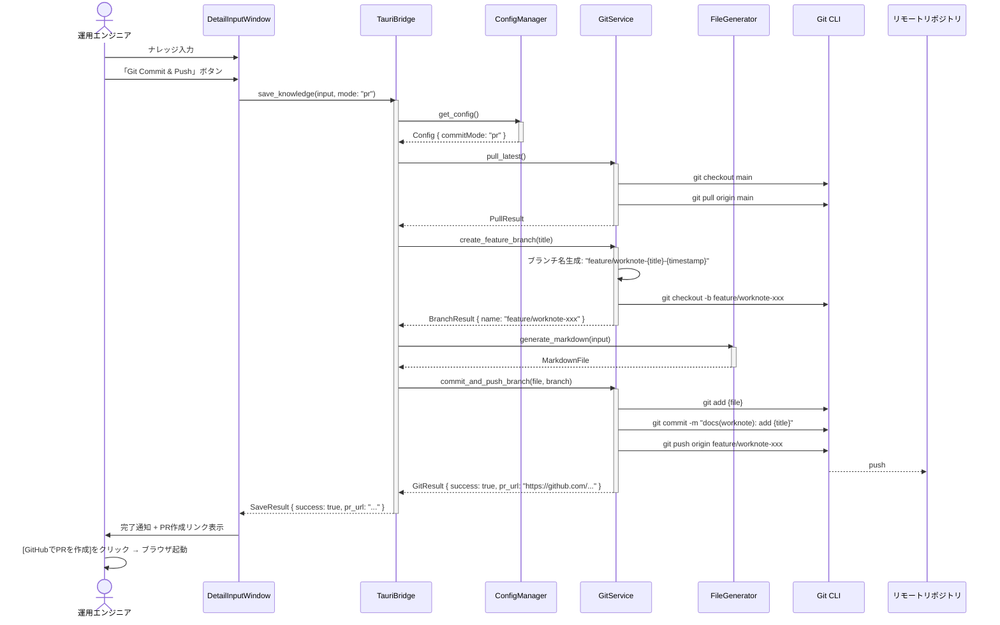
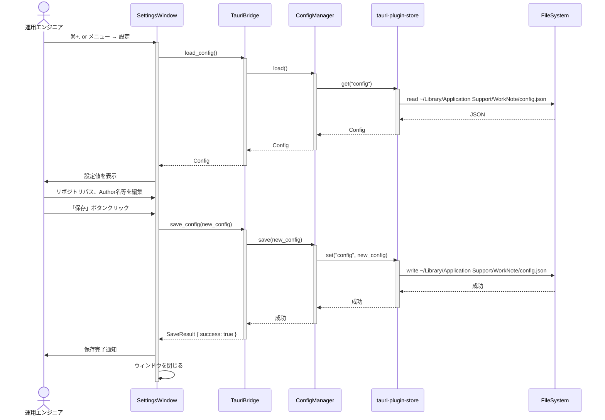
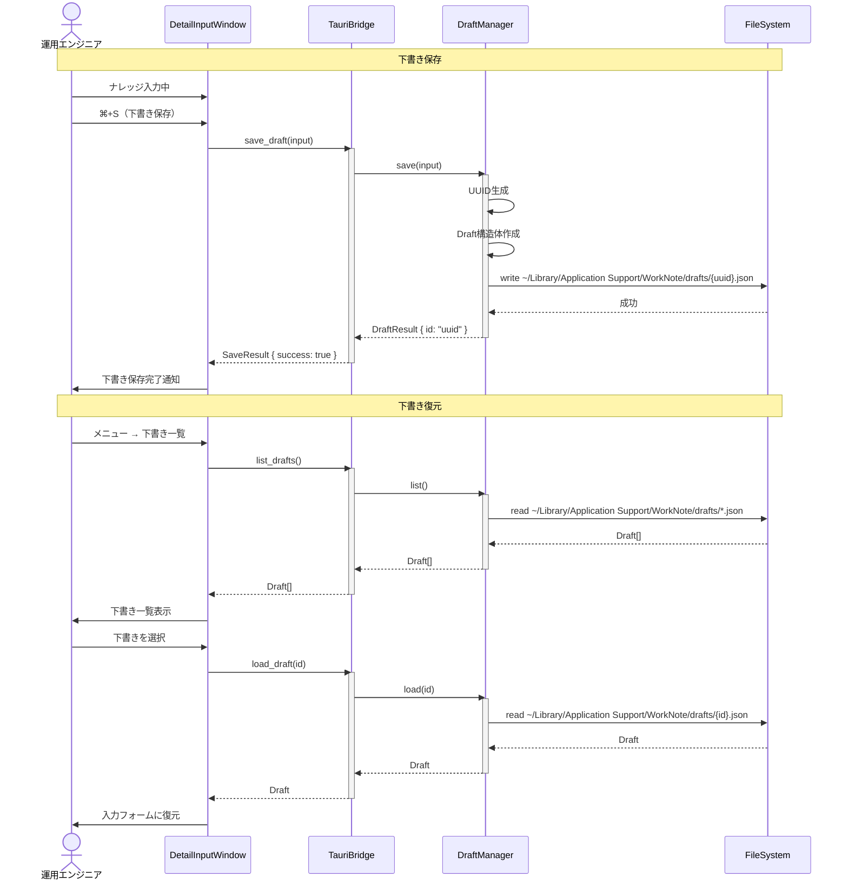
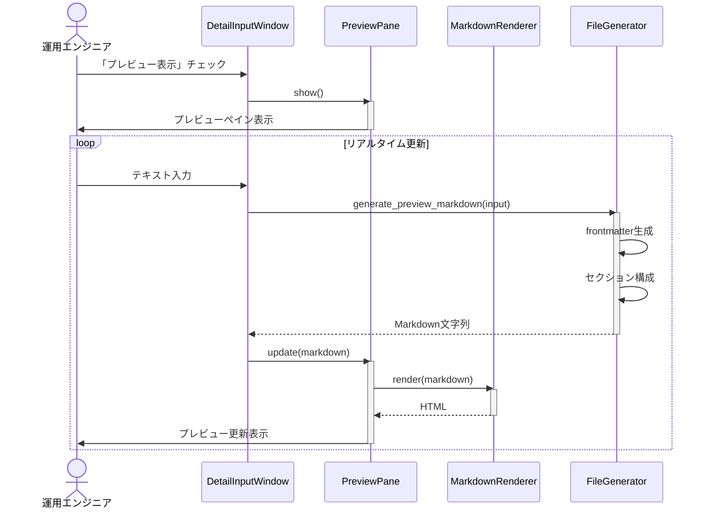
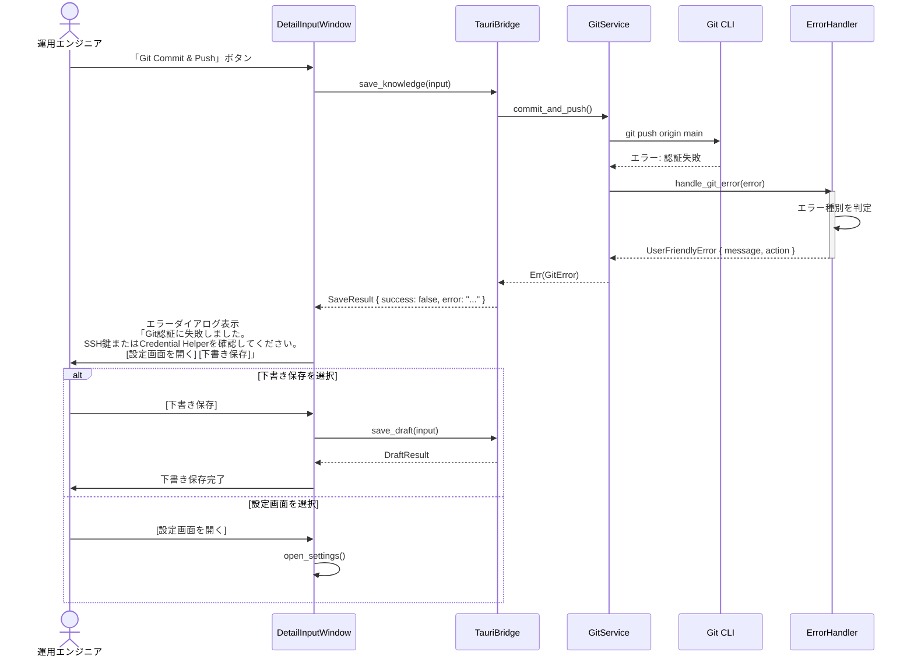
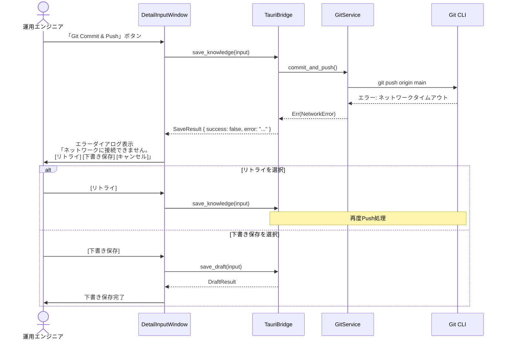
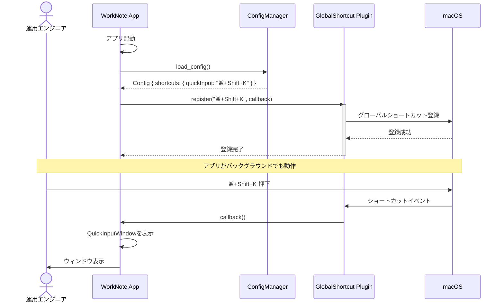

# シーケンス図: WorkNote

## 概要

本ドキュメントは、WorkNoteの主要な処理フローをシーケンス図で記述します。

---

## 1. クイック入力からの保存フロー（直接Pushモード）

---

## 2. 詳細入力からの保存フロー（直接Pushモード）

---

## 3. PR作成モードのフロー

---

## 4. 設定読み込み・保存フロー

---

## 5. 下書き保存・復元フロー

---

## 6. Markdownプレビューフロー

---

## 7. エラーハンドリングフロー

### 7.1 Git認証エラー

### 7.2 ネットワークエラー

---

## 8. グローバルショートカット登録フロー

---

## まとめ

WorkNoteの主要フローは以下の特徴を持ちます：

1. **シンプルな処理**: フロントエンド → バックエンド → Git CLI の明確な流れ
2. **エラーハンドリング**: 各エラーに対して適切な対処方法を提示
3. **非同期処理**: Tauri Commandによる非ブロッキング操作
4. **下書き保存**: ネットワークエラー時の損失防止

---

**文書情報**

| 項目 | 内容 |
|------|------|
| 作成日 | 2026-01-31 |
| 作成者 | Claude Code (michi:create-design) |
| バージョン | 1.0 |
| ステータス | 承認待ち |
