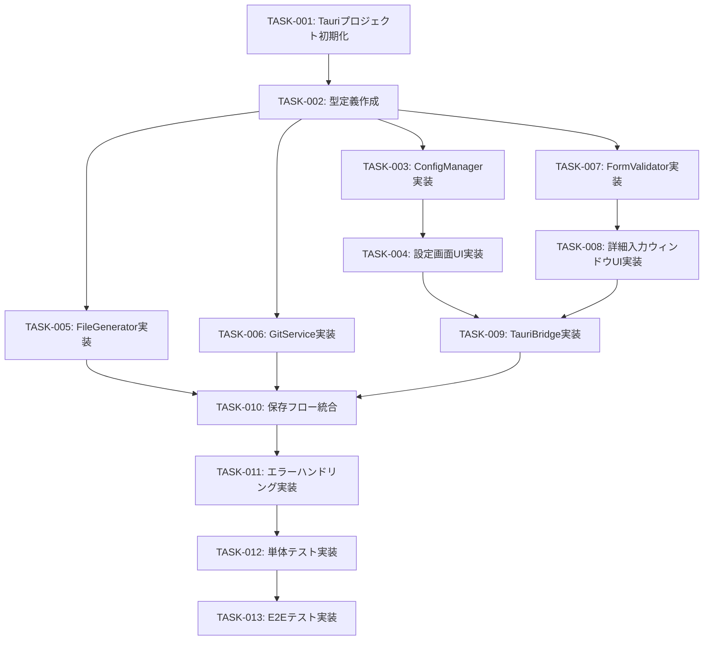

# タスク一覧: WorkNote

## プロジェクト概要

| 項目 | 内容 |
|------|------|
| **プロジェクト名** | WorkNote (20260131-worknote) |
| **目的** | macOS用ナレッジ管理デスクトップアプリ - 運用ナレッジを素早く入力し、Gitリポジトリに自動集約 |
| **スコープ** | Phase 1 MVP - 基本的なナレッジ入力→Git pushが動作する状態 |
| **技術スタック** | Tauri v2 + Svelte + TypeScript + Rust + Tailwind CSS |

---

## Phase 1 MVP - 機能スコープ

| 機能 | 要件ID | 説明 |
|------|--------|------|
| 詳細入力ウィンドウ | FR-002 | フル機能の入力フォームUI |
| 入力バリデーション | FR-003 | フロントエンド+バックエンド二重チェック |
| Git直接Pushモード | FR-005 | デフォルトブランチに直接commit & push |
| リポジトリ設定 | FR-007 | リポジトリパス、Author情報の設定 |
| Markdownファイル生成 | FR-010 | 統一フォーマットのMarkdown出力 |

---

## タスク依存関係図



---

## タスク一覧

### セットアップフェーズ

#### TASK-001: Tauriプロジェクト初期化

**説明**: Tauri v2 + Svelte + TypeScriptのプロジェクトを初期化し、基本的なディレクトリ構造を作成する

**依存**: なし

**優先度**: 🔴 必須

**見積もり**: 0.5日

**作業内容**:
1. Tauri CLIのインストール
2. Tauriプロジェクト作成（`npm create tauri-app`）
3. Svelte + TypeScriptテンプレート選択
4. Tailwind CSS設定
5. ディレクトリ構造作成（src/components/, src/lib/, src-tauri/src/services/等）
6. 依存ライブラリインストール（lucide-svelte等）

**成果物**:
- 実行可能なTauriアプリ（空のウィンドウ）
- package.json, Cargo.toml, tauri.conf.json

**テスト**:
- `npm run tauri dev` でアプリが起動することを確認

---

#### TASK-002: 型定義作成（TypeScript + Rust）

**説明**: フロントエンドとバックエンドの型定義を作成する

**依存**: TASK-001

**優先度**: 🔴 必須

**見積もり**: 0.5日

**作業内容**:
1. TypeScript型定義（src/lib/types.ts）
   - `KnowledgeInput`
   - `Config`, `GitConfig`, `AuthorConfig`
   - `ValidationError`, `ValidationResult`
   - `SaveKnowledgeResponse`

2. Rust構造体定義（src-tauri/src/models/）
   - `knowledge.rs` - `KnowledgeInput`, `Category`, `Severity`
   - `config.rs` - `Config`, `GitConfig`, `CommitMode`
   - `error.rs` - `WorkNoteError`（thiserror使用）

**成果物**:
- `src/lib/types.ts`
- `src-tauri/src/models/knowledge.rs`
- `src-tauri/src/models/config.rs`
- `src-tauri/src/models/error.rs`

**テスト**:
- TypeScriptがコンパイルエラーなし
- Rustがコンパイルエラーなし

---

### バックエンド実装フェーズ

#### TASK-003: ConfigManager実装（Rust）

**説明**: 設定ファイルの読み書きを管理するモジュールを実装する

**依存**: TASK-002

**優先度**: 🔴 必須

**見積もり**: 1日

**作業内容**:
1. `src-tauri/src/services/config_manager.rs` 作成
2. `load_config()` - 設定ファイル読み込み、デフォルト値提供
3. `save_config()` - 設定ファイル保存
4. tauri-plugin-store 統合
5. 設定バリデーション（リポジトリパス存在確認等）

**成果物**:
- `src-tauri/src/services/config_manager.rs`

**テスト**:
- 単体テスト: デフォルト値、読み書き、バリデーション

---

#### TASK-005: FileGenerator実装（Rust）

**説明**: Markdownファイル生成とkebab-case変換を実装する

**依存**: TASK-002

**優先度**: 🔴 必須

**見積もり**: 1日

**作業内容**:
1. `src-tauri/src/services/file_generator.rs` 作成
2. `to_kebab_case()` - ファイル名変換（日本語対応）
3. `generate_markdown()` - frontmatter + セクション構成
4. `write_file()` - ファイル書き込み（カテゴリディレクトリ作成）
5. ファイル名衝突対応（タイムスタンプ付加）

**成果物**:
- `src-tauri/src/services/file_generator.rs`

**テスト**:
- 単体テスト: kebab-case変換、Markdown生成、ファイル名衝突

---

#### TASK-006: GitService実装（Rust）

**説明**: Git操作（status, pull, commit, push）を実装する

**依存**: TASK-002

**優先度**: 🔴 必須

**見積もり**: 2日

**作業内容**:
1. `src-tauri/src/services/git_service.rs` 作成
2. `check_git_status()` - git status実行
3. `pull_latest()` - git checkout + git pull
4. `commit_and_push()` - git add + commit + push
5. エラー種別判定（認証エラー、ネットワークエラー）
6. コミットメッセージフォーマット実装

**成果物**:
- `src-tauri/src/services/git_service.rs`

**テスト**:
- 単体テスト（モック使用）: 正常系、認証エラー、ネットワークエラー

---

### フロントエンド実装フェーズ

#### TASK-007: FormValidator実装（TypeScript）

**説明**: フロントエンド入力バリデーションロジックを実装する

**依存**: TASK-002

**優先度**: 🔴 必須

**見積もり**: 1日

**作業内容**:
1. `src/lib/validation.ts` 作成
2. `validateTitle()` - タイトルバリデーション
3. `validateCategory()`, `validateSeverity()` - 選択肢バリデーション
4. `validateSymptoms()`, `validateProcedure()`, `validateNotes()`, `validateLinks()` - 文字数制限
5. `validateKnowledgeInput()` - 統合バリデーション

**成果物**:
- `src/lib/validation.ts`

**テスト**:
- 単体テスト: 13ケース（test-plan/unit/form-validator.md参照）

---

#### TASK-008: 詳細入力ウィンドウUI実装（Svelte）

**説明**: 詳細入力フォームのUIコンポーネントを実装する

**依存**: TASK-007

**優先度**: 🔴 必須

**見積もり**: 2日

**作業内容**:
1. `src/components/DetailInputWindow.svelte` 作成
2. タイトル、カテゴリ、重要度の入力フィールド
3. 症状、対応手順、注意点、関連リンクのテキストエリア
4. Tailwind CSSでスタイリング
5. バリデーションエラー表示
6. リアルタイムバリデーション（入力時に即座にチェック）
7. 「Git Commit & Push」ボタン

**成果物**:
- `src/components/DetailInputWindow.svelte`
- `src/components/FormField.svelte`（再利用可能なフォームフィールド）
- `src/components/ErrorMessage.svelte`（エラーメッセージ表示）

**テスト**:
- コンポーネントテスト: 入力、バリデーション、エラー表示

---

#### TASK-004: 設定画面UI実装（Svelte）

**説明**: 設定画面のUIコンポーネントを実装する

**依存**: TASK-003

**優先度**: 🔴 必須

**見積もり**: 1.5日

**作業内容**:
1. `src/components/SettingsWindow.svelte` 作成
2. リポジトリパス選択（ディレクトリ選択ダイアログ）
3. ナレッジ保存先、デフォルトブランチ入力
4. コミットモード選択（ラジオボタン）
5. Author名、メールアドレス入力
6. ショートカット設定（Phase 1ではデフォルト値のみ）
7. Tailwind CSSでスタイリング

**成果物**:
- `src/components/SettingsWindow.svelte`

**テスト**:
- コンポーネントテスト: 設定読み込み、保存

---

### 統合フェーズ

#### TASK-009: TauriBridge実装（TypeScript）

**説明**: フロントエンドからバックエンドへのコマンド呼び出しラッパーを実装する

**依存**: TASK-004, TASK-008

**優先度**: 🔴 必須

**見積もり**: 1日

**作業内容**:
1. `src/lib/tauri-bridge.ts` 作成
2. `saveKnowledge()` - Tauri Command呼び出し
3. `loadConfig()`, `saveConfig()` - 設定管理
4. `saveDraft()`, `listDrafts()`, `loadDraft()` - 下書き管理（Phase 1ではスタブ）
5. エラーハンドリング（Tauriのエラーをユーザーフレンドリーなメッセージに変換）

**成果物**:
- `src/lib/tauri-bridge.ts`

**テスト**:
- 単体テスト（モック使用）: 各コマンド呼び出し

---

#### TASK-010: 保存フロー統合（Tauri Command）

**説明**: フロントエンドからバックエンドまでの保存フローを統合する

**依存**: TASK-005, TASK-006, TASK-009

**優先度**: 🔴 必須

**見積もり**: 1.5日

**作業内容**:
1. `src-tauri/src/commands/knowledge.rs` 作成
2. `save_knowledge()` Tauri Command実装
   - バリデーション（ValidationHelper呼び出し）
   - Git status確認（GitService呼び出し）
   - Git pull実行（GitService呼び出し）
   - Markdownファイル生成（FileGenerator呼び出し）
   - Git commit & push（GitService呼び出し）
3. `src-tauri/src/commands/config.rs` 作成
4. `load_config()`, `save_config()` Tauri Command実装
5. main.rsにコマンドを登録

**成果物**:
- `src-tauri/src/commands/knowledge.rs`
- `src-tauri/src/commands/config.rs`
- `src-tauri/src/main.rs`（更新）

**テスト**:
- 統合テスト: フロントエンド→バックエンドの通信確認

---

#### TASK-011: エラーハンドリング実装

**説明**: 各種エラーのハンドリングとユーザー通知を実装する

**依存**: TASK-010

**優先度**: 🔴 必須

**見積もり**: 1日

**作業内容**:
1. `src-tauri/src/utils/error.rs` 更新
   - WorkNoteErrorの実装
   - ユーザーフレンドリーなメッセージ生成
2. `src/components/ErrorDialog.svelte` 作成
   - エラーダイアログUI
   - アクションボタン（リトライ、下書き保存、設定画面を開く）
3. エラー通知（Tauri Notification API）

**成果物**:
- `src-tauri/src/utils/error.rs`
- `src/components/ErrorDialog.svelte`

**テスト**:
- 単体テスト: エラーメッセージ生成
- E2Eテスト: エラーダイアログ表示

---

### テストフェーズ

#### TASK-012: 単体テスト実装

**説明**: 単体テストをすべて実装し、カバレッジ95%以上を達成する

**依存**: TASK-011

**優先度**: 🔴 必須

**見積もり**: 2日

**作業内容**:
1. **フロントエンド単体テスト**
   - FormValidator: 13ケース（test-plan/unit/form-validator.md参照）
   - MarkdownRenderer: 14ケース（XSS対策含む）

2. **バックエンド単体テスト**
   - GitService: 7ケース（モック使用）
   - FileGenerator: kebab-case変換、Markdown生成
   - ConfigManager: 設定読み書き

3. **カバレッジ測定**
   - フロントエンド: c8 / Istanbul
   - バックエンド: Tarpaulin

**成果物**:
- `src/lib/__tests__/validation.test.ts`
- `src/lib/__tests__/markdown-renderer.test.ts`
- `src-tauri/src/services/git_service.rs`（`#[cfg(test)]` mod tests）
- `src-tauri/src/services/file_generator.rs`（`#[cfg(test)]` mod tests）

**完了基準**:
- ✅ カバレッジ95%以上
- ✅ すべてのテストがパス
- ✅ XSS対策テストがすべてパス

---

#### TASK-013: E2Eテスト実装

**説明**: 主要なユーザーシナリオのE2Eテストを実装する

**依存**: TASK-012

**優先度**: 🔴 必須

**見積もり**: 2日

**作業内容**:
1. **Playwright設定**
   - Tauriアプリ用のPlaywright設定
   - テストリポジトリのセットアップ

2. **E2Eテスト実装**
   - TC-E2E-001: ナレッジ入力→直接Push（正常系）
   - TC-E2E-002: バリデーションエラーの表示
   - TC-E2E-003: 文字数制限の検証
   - TC-E2E-101: 設定保存・読み込み
   - TC-E2E-102: Git認証エラーのハンドリング
   - TC-E2E-103: ネットワークエラーのハンドリング
   - TC-E2E-104: 設定バリデーション

3. **テスト環境構築**
   - テストリポジトリ（worknote-e2e-test）の初期化
   - クリーンアップスクリプト

**成果物**:
- `tests/e2e/knowledge-input-to-push.spec.ts`
- `tests/e2e/settings-and-errors.spec.ts`
- `tests/setup/test-repo-setup.sh`

**完了基準**:
- ✅ 主要シナリオ100%パス
- ✅ CI/CDで自動実行可能

---

## タスク実行順序

### Week 1: セットアップ + バックエンド基盤

| 日 | タスク | 説明 |
|----|--------|------|
| Day 1 | TASK-001 | プロジェクト初期化 |
| Day 1-2 | TASK-002 | 型定義作成 |
| Day 2-3 | TASK-003 | ConfigManager実装 |
| Day 3-4 | TASK-005 | FileGenerator実装 |

### Week 2: バックエンド完成 + フロントエンド開始

| 日 | タスク | 説明 |
|----|--------|------|
| Day 5-6 | TASK-006 | GitService実装（Git操作） |
| Day 7 | TASK-007 | FormValidator実装 |
| Day 8-9 | TASK-008 | 詳細入力ウィンドウUI |

### Week 3: 統合 + テスト

| 日 | タスク | 説明 |
|----|--------|------|
| Day 9-10 | TASK-004 | 設定画面UI実装 |
| Day 10 | TASK-009 | TauriBridge実装 |
| Day 11 | TASK-010 | 保存フロー統合 |
| Day 12 | TASK-011 | エラーハンドリング |
| Day 13-14 | TASK-012 | 単体テスト実装 |
| Day 15-16 | TASK-013 | E2Eテスト実装 |

**総見積もり**: **16日**（約3週間）

---

## リスク管理

### 技術的リスク

| リスク | 影響度 | 発生確率 | 軽減策 | 対応タスク |
|--------|--------|----------|--------|-----------|
| Tauri v2の不安定性 | 高 | 中 | 安定版を待つ、またはv1を検討 | TASK-001 |
| Git認証の複雑さ | 中 | 高 | エラーメッセージで丁寧に案内 | TASK-006, TASK-011 |
| 日本語ファイル名変換 | 低 | 中 | タイムスタンプ+連番で回避 | TASK-005 |
| XSS脆弱性 | 高 | 低 | DOMPurifyで必ずサニタイズ | TASK-012（テストで検証） |

### スケジュールリスク

| リスク | 影響度 | 発生確率 | 軽減策 |
|--------|--------|----------|--------|
| 見積もりオーバー | 中 | 中 | バッファ20%を考慮（16日 → 19日） |
| Git操作の想定外の複雑さ | 中 | 中 | TASK-006を2.5日に延長可能 |

---

## コードサイズ見積もり

| タスク | 推定行数 | 備考 |
|--------|----------|------|
| TASK-001 | 100行 | 設定ファイルメイン |
| TASK-002 | 150行 | 型定義 |
| TASK-003 | 200行 | ConfigManager |
| TASK-004 | 250行 | 設定画面UI |
| TASK-005 | 200行 | FileGenerator |
| TASK-006 | 300行 | GitService（重要） |
| TASK-007 | 150行 | FormValidator |
| TASK-008 | 350行 | 詳細入力ウィンドウUI |
| TASK-009 | 150行 | TauriBridge |
| TASK-010 | 200行 | 保存フロー統合 |
| TASK-011 | 200行 | エラーハンドリング |
| TASK-012 | 500行 | 単体テスト |
| TASK-013 | 400行 | E2Eテスト |
| **合計** | **3,150行** | Phase 1 MVP |

**PRサイズ監視**: 各タスク完了時にpr-size-monitorエージェントが500行超過時に警告

---

## 完了基準（Definition of Done）

各タスク完了時に以下を確認：

1. ✅ コードが実装され、動作確認済み
2. ✅ 単体テストが実装され、すべてパス
3. ✅ カバレッジ95%以上（該当する場合）
4. ✅ TypeScript/Rustのコンパイルエラーなし
5. ✅ Linterエラーなし（ESLint, Clippy）
6. ✅ コードレビュー完了（セルフレビュー or チームレビュー）
7. ✅ ドキュメント更新（必要に応じて）

---

## 次のステップ

タスク分割が完了しましたので、実装を開始できます：

### 推奨: TDD実装開始

```bash
/michi dev 20260131-worknote
```

このコマンドで以下が実行されます：
- TASK-001から順番に実装
- Red-Green-Refactorサイクル
- 自動テスト実行
- 自動コードレビュー

---

**文書情報**

| 項目 | 内容 |
|------|------|
| 作成日 | 2026-01-31 |
| 作成者 | Claude Code (michi:create-tasks) |
| バージョン | 1.0 |
| ステータス | 承認待ち |
| 総タスク数 | 13タスク |
| 総見積もり | 16日 |
