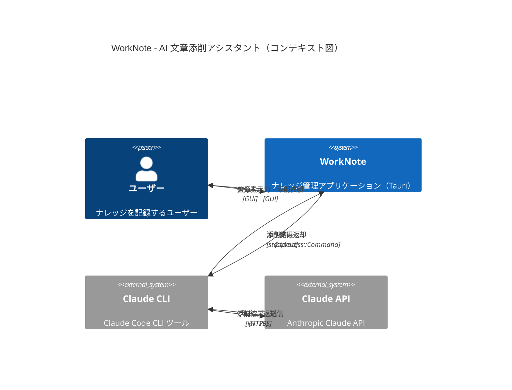
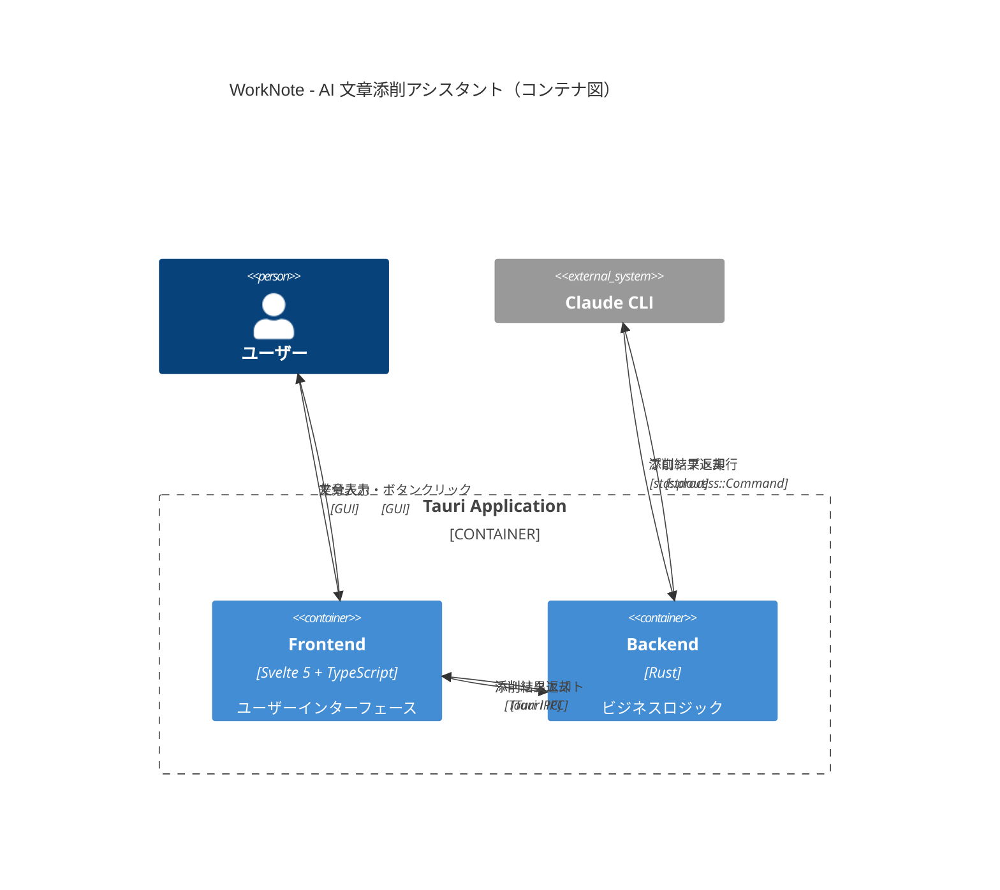
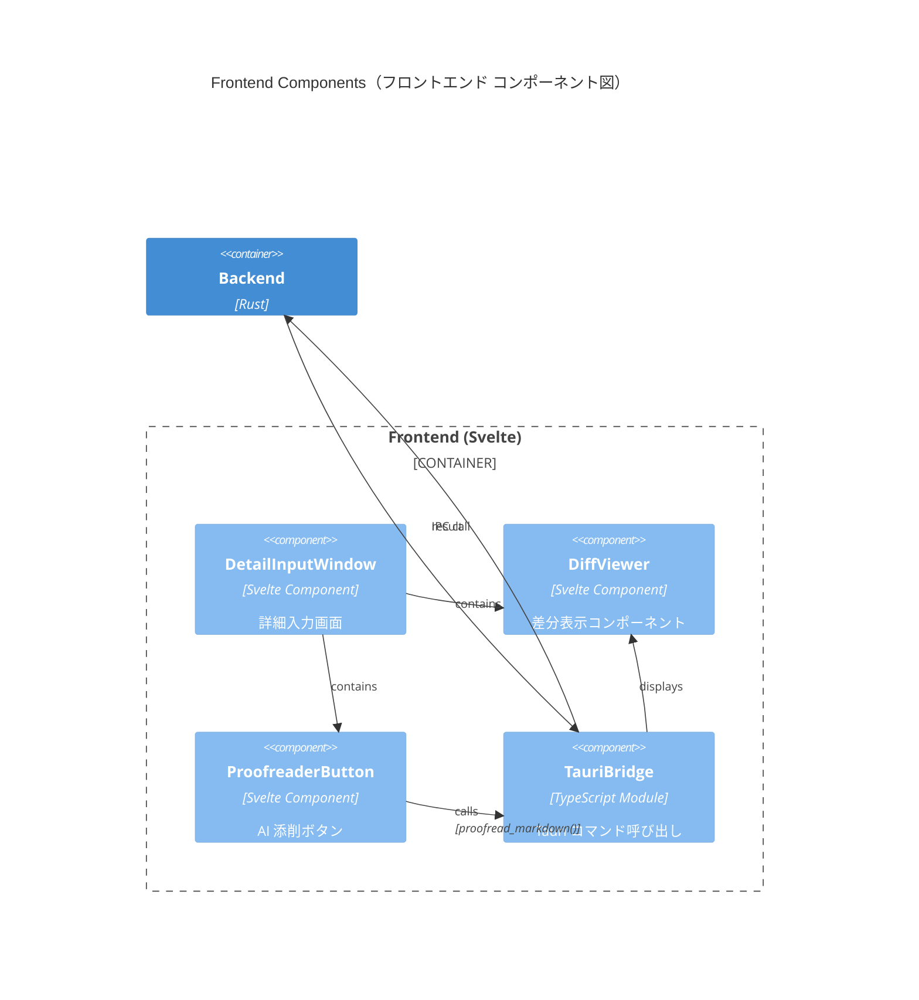
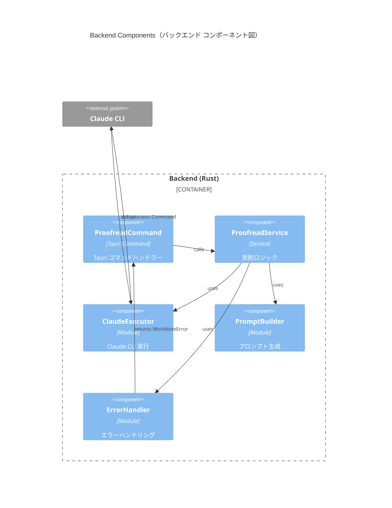
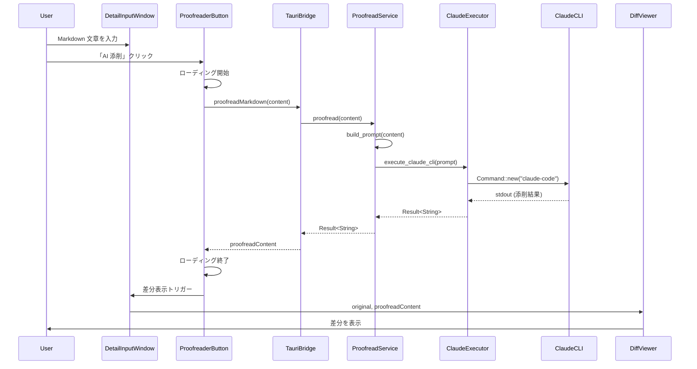
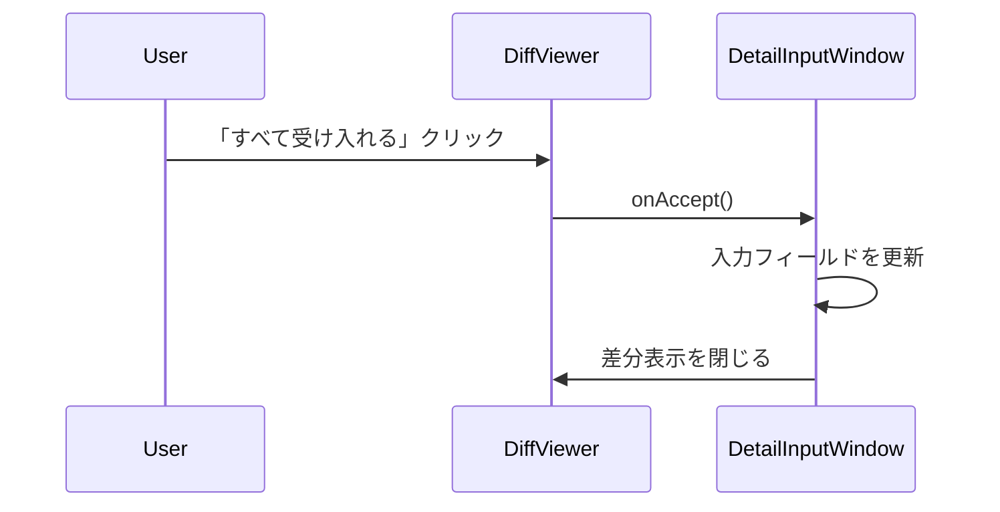
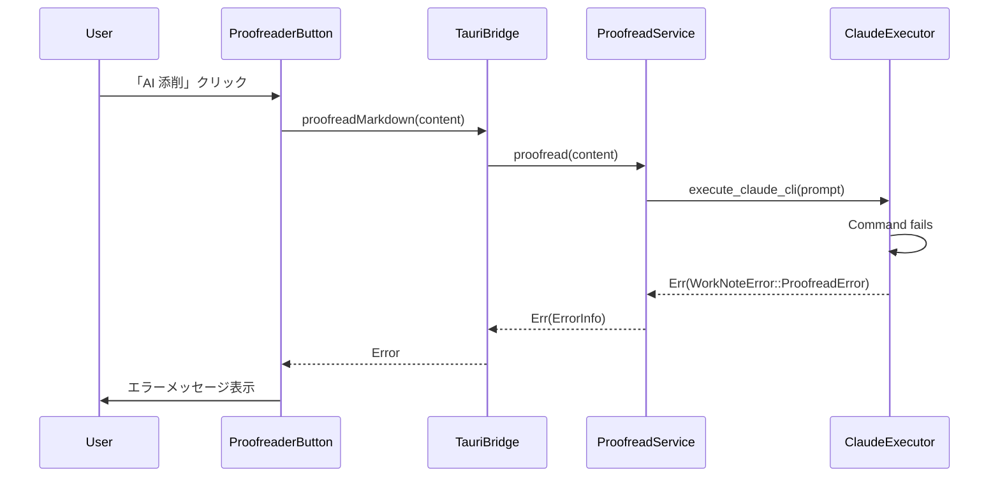

# アーキテクチャ設計書: Phase 3 - AI 文章添削アシスタント

## 概要

このドキュメントは、WorkNote Phase 3 の AI 文章添削アシスタント機能のアーキテクチャを C4 モデルに基づいて記述します。

---

## C4 モデル

### Level 1: Context Diagram（コンテキスト図）



**説明**:
- **ユーザー**: WorkNote を使用してナレッジを記録する
- **WorkNote**: Tauri アプリケーション（フロントエンド: Svelte、バックエンド: Rust）
- **Claude CLI**: `claude-code` コマンド（ユーザー環境にインストール）
- **Claude API**: Anthropic が提供する Claude API

---

### Level 2: Container Diagram（コンテナ図）



**コンテナ**:
1. **Frontend（Svelte 5 + TypeScript）**:
   - DetailInputWindow コンポーネント
   - DiffViewer コンポーネント
   - AI 添削ボタン

2. **Backend（Rust）**:
   - ProofreadService（Claude CLI 実行）
   - プロンプト生成
   - エラーハンドリング

---

### Level 3: Component Diagram（コンポーネント図）

#### Frontend Components



**コンポーネント説明**:

1. **DetailInputWindow**: 詳細入力ウィンドウ（既存コンポーネント）
   - Markdown 入力フォーム
   - AI 添削ボタンを配置
   - 差分表示エリアを含む

2. **ProofreaderButton**: AI 添削ボタン
   - クリックイベントで `proofread_markdown()` を呼び出す
   - ローディング状態を表示

3. **DiffViewer**: 差分表示コンポーネント
   - 元の文章と添削後の文章を比較表示
   - GitHub PR 風のスタイル（赤・緑）
   - 「すべて受け入れる」「すべて却下する」ボタン

4. **TauriBridge**: Tauri コマンド呼び出しラッパー
   - `proofread_markdown(content: string)` メソッド
   - エラーハンドリング

#### Backend Components



**コンポーネント説明**:

1. **ProofreadCommand**: Tauri コマンド
   - `#[tauri::command] async fn proofread_markdown(content: String) -> Result<String, ErrorInfo>`
   - フロントエンドからの IPC リクエストを受け取る

2. **ProofreadService**: 添削サービス
   - `fn proofread(&self, content: &str) -> Result<String>`
   - プロンプト生成と Claude CLI 実行を調整

3. **ClaudeExecutor**: Claude CLI 実行モジュール
   - `fn execute_claude_cli(&self, prompt: &str) -> Result<String>`
   - `std::process::Command` で `claude-code` を実行
   - タイムアウト処理（30 秒）

4. **PromptBuilder**: プロンプト生成モジュール
   - `fn build_proofreading_prompt(&self, content: &str) -> String`
   - EARS 形式のプロンプトを生成

5. **ErrorHandler**: エラーハンドリング
   - Claude CLI が見つからない
   - タイムアウト
   - API エラー

---

### Level 4: Code Diagram（コード図）

#### Rust Code Structure

```rust
// src-tauri/src/commands/proofreader.rs

use crate::models::error::{ErrorInfo, Result};
use crate::services::proofreader_service::ProofreadService;
use tauri::AppHandle;

#[tauri::command]
pub async fn proofread_markdown(
    app: AppHandle,
    content: String,
) -> std::result::Result<String, ErrorInfo> {
    let service = ProofreadService::new();
    service.proofread(&content)
        .map_err(ErrorInfo::from)
}
```

```rust
// src-tauri/src/services/proofreader_service.rs

use crate::models::error::{Result, WorkNoteError};
use std::process::Command;
use std::time::Duration;

pub struct ProofreadService {
    timeout: Duration,
}

impl ProofreadService {
    pub fn new() -> Self {
        Self {
            timeout: Duration::from_secs(30),
        }
    }

    pub fn proofread(&self, content: &str) -> Result<String> {
        let prompt = self.build_prompt(content);
        self.execute_claude_cli(&prompt)
    }

    fn build_prompt(&self, content: &str) -> String {
        format!(
            r#"あなたは Markdown 文章の添削アシスタントです。以下の文章を添削してください：

- タイポ修正（スペルミス、誤字脱字）
- 文章構成の改善（読みやすさ、論理的な流れ）
- 不足している情報の補足

元の文章:
{}

添削後の文章を Markdown 形式で返してください。変更箇所のみを返すのではなく、全文を返してください。
"#,
            content
        )
    }

    fn execute_claude_cli(&self, prompt: &str) -> Result<String> {
        let output = Command::new("claude-code")
            .arg("chat")
            .arg("--input")
            .arg(prompt)
            .output()
            .map_err(|e| WorkNoteError::ProofreadError(
                format!("Failed to execute claude-code: {}", e)
            ))?;

        if !output.status.success() {
            return Err(WorkNoteError::ProofreadError(
                format!("claude-code exited with status: {}", output.status)
            ));
        }

        let result = String::from_utf8(output.stdout)
            .map_err(|e| WorkNoteError::ProofreadError(
                format!("Failed to parse claude-code output: {}", e)
            ))?;

        Ok(result)
    }
}
```

#### TypeScript Code Structure

```typescript
// src/lib/tauri-bridge.ts

import { invoke } from '@tauri-apps/api/core';

export interface ProofreadResult {
  originalContent: string;
  proofreadContent: string;
}

export async function proofreadMarkdown(
  content: string
): Promise<string> {
  try {
    const result = await invoke<string>('proofread_markdown', {
      content,
    });
    return result;
  } catch (error) {
    throw new Error(`AI 添削に失敗しました: ${error}`);
  }
}
```

```svelte
<!-- src/components/DiffViewer.svelte -->
<script lang="ts">
  import { diffLines } from 'diff';

  export let original: string;
  export let proofread: string;
  export let onAccept: () => void;
  export let onReject: () => void;

  $: diff = diffLines(original, proofread);
</script>

<div class="diff-viewer">
  <div class="diff-header">
    <h3>添削結果</h3>
    <div class="actions">
      <button on:click={onAccept}>すべて受け入れる</button>
      <button on:click={onReject}>すべて却下する</button>
    </div>
  </div>

  <div class="diff-content">
    {#each diff as part}
      {#if part.added}
        <div class="diff-line added">+ {part.value}</div>
      {:else if part.removed}
        <div class="diff-line removed">- {part.value}</div>
      {:else}
        <div class="diff-line">{part.value}</div>
      {/if}
    {/each}
  </div>
</div>

<style>
  .diff-viewer {
    border: 1px solid #e1e4e8;
    border-radius: 6px;
    margin: 16px 0;
  }

  .diff-header {
    display: flex;
    justify-content: space-between;
    align-items: center;
    padding: 12px 16px;
    background: #f6f8fa;
    border-bottom: 1px solid #e1e4e8;
  }

  .diff-content {
    padding: 16px;
    font-family: monospace;
    font-size: 14px;
  }

  .diff-line {
    padding: 2px 4px;
  }

  .diff-line.added {
    background: #e6ffed;
    color: #22863a;
  }

  .diff-line.removed {
    background: #ffeef0;
    color: #cb2431;
    text-decoration: line-through;
  }
</style>
```

---

## データフロー

### 添削実行フロー



### 受け入れフロー



### エラーハンドリングフロー



---

## 技術スタック

### Frontend
- **Framework**: Svelte 5
- **Language**: TypeScript
- **UI Library**: Tailwind CSS
- **Diff Library**: `diff` (jsdiff)
- **IPC**: Tauri IPC

### Backend
- **Language**: Rust 2021 Edition
- **Framework**: Tauri 2.x
- **CLI Execution**: `std::process::Command`
- **Error Handling**: `thiserror`, `Result<T, E>`

### External
- **Claude CLI**: `claude-code` (ユーザー環境にインストール)

---

## セキュリティ考慮事項

1. **入力検証**:
   - Markdown コンテンツのサイズ制限（例: 10,000 文字以下）
   - 悪意のあるコマンド注入を防ぐため、プロンプト内の特殊文字をエスケープ

2. **認証情報管理**:
   - Claude CLI の API キーは環境変数で管理
   - Tauri アプリケーションから直接 API キーにアクセスしない

3. **ネットワークセキュリティ**:
   - Claude CLI は HTTPS 経由で Claude API と通信

4. **ユーザー通知**:
   - 初回使用時に警告メッセージを表示: 「この機能は Claude AI に文章を送信します。機密情報を含まないことを確認してください」

---

## パフォーマンス最適化

1. **タイムアウト設定**:
   - Claude CLI 実行のタイムアウトを 30 秒に設定
   - タイムアウト時はエラーメッセージを表示

2. **ローディング UI**:
   - 「AI 添削」ボタンにローディングスピナーを表示
   - ユーザーに処理中であることを明示

3. **キャッシュ（将来拡張）**:
   - 同じ文章の添削結果をキャッシュ（Phase 4 以降で検討）

---

## 拡張性

Phase 4 以降で以下の拡張を検討：

1. **添削種類の選択**:
   - チェックボックスで「タイポのみ」「構成のみ」等を選択可能に

2. **部分的な受け入れ・却下**:
   - 差分の一部のみを適用できる UI

3. **添削履歴**:
   - 過去の添削結果を保存・管理

4. **複数言語対応**:
   - 英語以外の文章添削（日本語、中国語等）

---

## 参照

- **要件定義書**: `phase3-requirements.md`
- **C4 モデル**: [C4 Model](https://c4model.com/)
- **Mermaid 構文**: [Mermaid](https://mermaid.js.org/)

---

**次のステップ**: タスク分割（`/michi:create-tasks phase3-ai-proofreader`）
